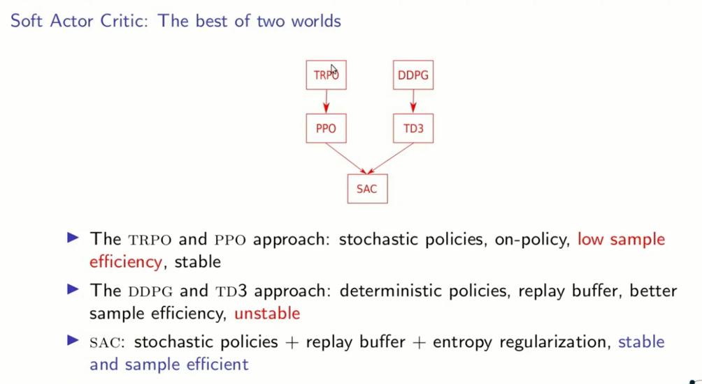

# SAC 算法解读

**SAC算法属于：**

* Off-policy 
* Maximum Entropy RL（最大熵强化学习）

## 为什么研究 Maximum Entropy Reinforcement Learning?

对于一般的DRL，学习目标很直接，就是学习一个policy使得累加的reward期望值最大：

而最大熵RL，除了上面的基本目标，还要求policy的每一次输出的action 熵entropy最大：

**这样做的目的在于：** 让策略随机化，即输出的每一个action的概率尽可能分散，而不是集中在一个action上。

### stochastic Policy 相比于deterministic Policy的优势：
Stochastic policy随机策略在实际机器人控制上往往是更好的做法。比如我们让机器人抓取一个水杯，机器人是有无数条路径去实现这个过程的，而并不是只有唯一的一种做法。因此，我们就需要drl算法能够给出一个随机策略，在每一个state上都能输出每一种action的概率，比如有3个action都是最优的，概率一样都最大，那么我们就可以从这些action中随机选择一个做出action输出。最大熵maximum entropy的核心思想就是不遗落到任意一个有用的action，有用的trajectory。对比DDPG的deterministic policy的做法，看到一个好的就捡起来，差一点的就不要了，而最大熵是都要捡起来，都要考虑。

### 基于最大熵的RL算法有什么优势？

以前用deterministic policy的算法，我们找到了一条最优路径，学习过程也就结束了。现在，我们还要求熵最大，就意味着神经网络需要去explore探索所有可能的最优路径，这可以产生以下多种优势：

* 学到policy可以作为更复杂具体任务的初始化。因为通过最大熵，policy不仅仅学到一种解决任务的方法，同时会关注其他信息，因此这样的policy就更有利于去学习新的任务。比如我们一开始是学走，然后之后要学朝某一个特定方向走。
* 更强的exploration能力，这是显而易见的，能够更容易的在多模态reward（multimodal reward）下找到更好的模式。比如既要求机器人走的好，又要求机器人节约能源。
* 更robust，更强的generalization。因为要从不同的方式来探索各种最优的可能性，也因此面对干扰的时候能够更容易做出调整。（干扰会是神经网络学习过程中看到的一种state，既然已经探索到了，学到了就可以更好的做出反应，继续获取高reward）

既然最大熵RL算法这么好，我们当然应该研究它了。而实际上，在之前的DRL算法A3C中，我们其实已经用了一下最大熵：

**在训练policy的时候，A3C加了entropy项，作为一个regularizer，让policy更随机。不过A3C这么做主要是为了更好做exploration，整体的训练目标依然只考虑reward。这和Soft Actor-Critic的设定还是不一样的，Soft Actor-Critic是真正最大熵DRL算法。**

## Maximum Entropy Reinforcement Learning的Bellman方程

那么对于最大熵（MaxEnt)的目标，其实可以把熵也作为reward的一部分，我们在计算q值时（记住q是累加reward的期望，传统rl的目标等价于让q最大），就需要计算每一个state的熵entropy (entropy的公式如下图所示）：

因此我们就可以得到Soft Bellman Backup equation (Entropy项额外乘上$\alpha$系数：

Recall一下Dynamic Programming Backup：

对应Q值的公式是

 (5)

根据公式（4），我们可以得到Soft Bellman Backup的 更新公式：

 (6)

上面公式（6）是直接使用dynamic programming，将entropy嵌入计算得到的结果。我们可以反过来先直接把entropy作为reward的一部分：

 (7)

我们将（7）带入到公式（5）：

![](https://www.zhihu.com/equation?tex=%5Cbegin%7Bequation%7D+%5Cbegin%7Bsplit%7D+Q_%7Bsoft%7D%28s_t%2Ca_t%29%26%3Dr%28s_t%2Ca_t%29+%2B%5Cgamma%5Calpha%5Cmathbb%7BE%7D_%7Bs_%7Bt%2B1%7D%5Csim%5Crho%7DH%28%5Cpi%28%5Ccdot%7Cs_%7Bt%2B1%7D%29%29+%2B+%5Cgamma%5Cmathbb%7BE%7D_%7Bs_%7Bt%2B1%7D%2Ca_%7Bt%2B1%7D%7D%5BQ_%7Bsoft%7D%28s_%7Bt%2B1%7D%2Ca_%7Bt%2B1%7D%29%5D%5C%5C+%26%3Dr%28s_t%2Ca_t%29+%2B%5Cgamma%5Cmathbb%7BE%7D_%7Bs_%7Bt%2B1%7D%5Csim%5Crho%2Ca_%7Bt%2B1%7D%5Csim+%5Cpi%7D%5BQ_%7Bsoft%7D%28s_%7Bt%2B1%7D%2Ca_%7Bt%2B1%7D%29%5D+%2B++%5Cgamma+%5Calpha%5Cmathbb%7BE%7D_%7Bs_%7Bt%2B1%7D%5Csim%5Crho%7DH%28%5Cpi%28%5Ccdot%7Cs_%7Bt%2B1%7D%29%29%5C%5C+%26%3Dr%28s_t%2Ca_t%29+%2B%5Cgamma%5Cmathbb%7BE%7D_%7Bs_%7Bt%2B1%7D%5Csim%5Crho%2Ca_%7Bt%2B1%7D%5Csim+%5Cpi%7D%5BQ_%7Bsoft%7D%28s_%7Bt%2B1%7D%2Ca_%7Bt%2B1%7D%29%5D+%2B++%5Cgamma%5Cmathbb%7BE%7D_%7Bs_%7Bt%2B1%7D%5Csim%5Crho%7D%5Cmathbb%7BE_%7Ba_%7Bt%2B1%7D%5Csim%5Cpi%7D%7D%5B-%5Calpha+%5Clog%5Cpi%28a_%7Bt%2B1%7D%7Cs_%7Bt%2B1%7D%29%5D%5C%5C+%26%3Dr%28s_t%2Ca_t%29+%2B+%5Cgamma+%5Cmathbb%7BE%7D_%7Bs_%7Bt%2B1%7D%5Csim%5Crho%7D%5B%5Cmathbb%7BE%7D_%7Ba_%7Bt%2B1%7D%5Csim%5Cpi%7D%5BQ_%7Bsoft%7D%28s_%7Bt%2B1%7D%2Ca_%7Bt%2B1%7D%29-%5Calpha+%5Clog%28%5Cpi%28a_%7Bt%2B1%7D%7Cs_%7Bt%2B1%7D%29%29%5D%5D%5C%5C+%26%3Dr%28s_t%2Ca_t%29+%2B+%5Cgamma%5Cmathbb%7BE%7D_%7Bs_%7Bt%2B1%7D%2Ca_%7Bt%2B1%7D%7D%5BQ_%7Bsoft%7D%28s_%7Bt%2B1%7D%2Ca_%7Bt%2B1%7D%29-%5Calpha+%5Clog%28%5Cpi%28a_%7Bt%2B1%7D%7Cs_%7Bt%2B1%7D%29%29%5D+%5Cend%7Bsplit%7D+%5Cend%7Bequation%7D)

可以得到一样的结果。

## 为什么称为soft？哪里soft了？以及为什么soft Q function能够实现maximum entropy？

理解清楚这个问题是理解明白soft q-learning及sac的关键！

先理解Soft-Q-Learning:

上面的曲线很明显的说明了stochastic policy的重要性，面对多模的（multimodal）的Q function，传统的RL只能收敛到一个选择（左图），而更优的办法是右图，让policy也直接符合Q的分布。这里，最直接的一种办法就是定义这样的energy-based policy：

其中 $\mathical{\epsilon}$ 是能量函数，上面的形式就是Boltzmann Distribution 玻尔兹曼分布 。下图的 $-f(x)=\mathcal{\epsilon}$

为了连接soft Q function，我们可以设定

因此，我们有

 (13)

这样的policy能够为每一个action赋值一个特定的概率符合Q值的分布，也就满足了stochastic policy的需求。

下面我们要发现（13）的形式正好就是最大熵RL的optimal policy最优策略的形式，而这实现了soft q function和maximum entropy的连接。

实际上我们理解Soft Q-Learning及Soft Actor Critic，要清楚上图三者的关系。在Soft Q-Learning那篇paper中，他是从Soft Value Function的定义出发去连接Energy-Based Policy 和Maximum Entropy Objective的关系。而在本blog中，我们从Maximum Entropy Objective出发，来连接其他两部分。

 (14)

（14）符合了（13）, $\frac{1}{\alpha}V_{soft}(s_t)$可以看做是对应的log partition function. 由此，就连接了Maximum Entropy Objective和Energy Based Policy的关系。

下面我们要连接Soft Value Function。从（14）的  $\frac{1}{\alpha}V_{soft}(s_t)$已经很明显了：

因此，我们可以定义 $V_{soft}(s_t)$ :

这和soft 有什么关系呢？(16）其实是LogSumExp的积分形式，就是smooth maximum/soft maximum (软的最大）。

所以就可以定义

因此我们也就可以根据公式（9）定义soft的Q-function：

所以，为什么称为soft是从这里来的。

这里有一个常见的疑问就是这里的soft max和我们常见的softmax好像不一样啊。是的，我们在神经网络中常用的activation function softmax 实际上是soft argmax，根据一堆logits找到对应的软的最大值对应的index。
上面的推导还只是面向policy的value和Q，我们下面要说明optimal policy也必然是energy-based policy的形式。
这一部分的证明依靠 Policy improvement theorem：

具体证明过程见soft q-learning原文的A.1。

有了Theorem 4，

我们就可以看到optimal policy必然是energy based policy，也因此，我们有了soft q learning paper中最开始的定义：

